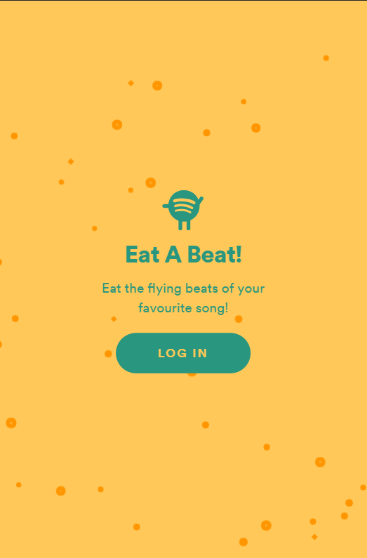
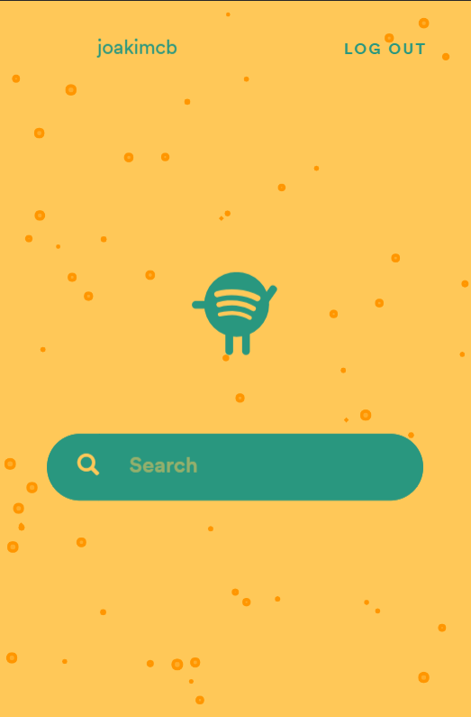
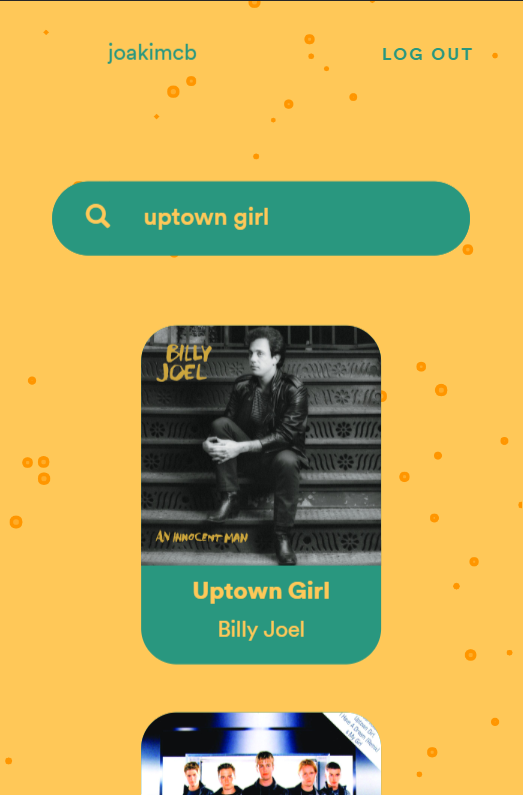
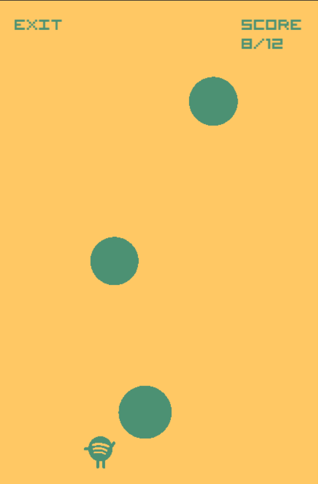
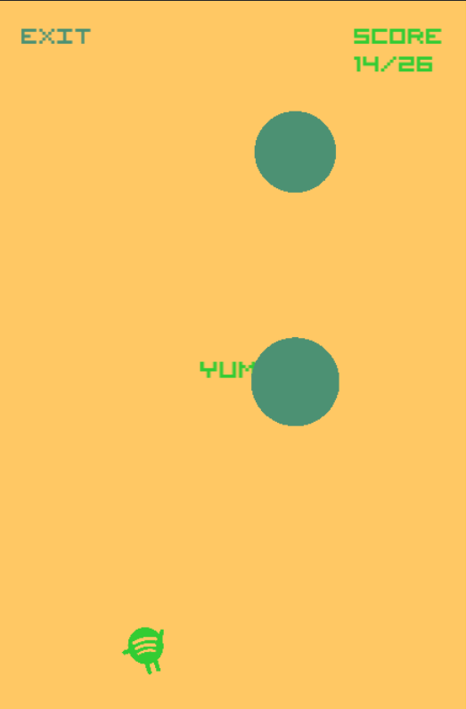
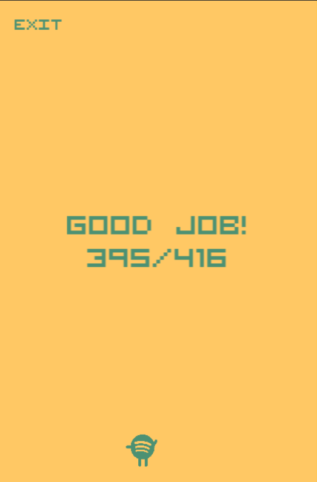

#  Eat A Beat
A 2D game generated from a song, powered by Spotify. This project won 1st place on Spotify DevX Hackathon 2018.

## The team
* Joakim Berntsson
* Raha Dadgar
* Iman Radjavi
* Simon Takman

## Game design
Summary of game features:
* Song tempo decides the speed of the obstacles
* Obstacles are spawned for each beat
* The average pitch of a beat decides the position of the obstacle
* The confidence of the beat decides the size of the obstacle

## Design
  
  
 

## Backend
Developed using node.js with the following technologies:
* Express
* Spotify Web API

## Frontend
Developed using the following technologies:
* JQuery
* [Pixie.js](https://github.com/pixijs/pixi.js)
* Spotify Player
* [Cookie.js](https://github.com/js-cookie/js-cookie)
* [Pixi Particles](https://github.com/pixijs/pixi-particles)

## Setup & run
If you want to run this yourself, here are the steps:
1. Clone this reposity
2. Create a file '.env' in the root of the repository
3. Create an application at spotify developer site
4. Add callback to 'localhost:3000' on the spotify application
5. Insert your spotify client ID and SECRET inside the '.env' file as "SPOTIFY_ID=..." and "SPOTIFY_SECRET=..."
